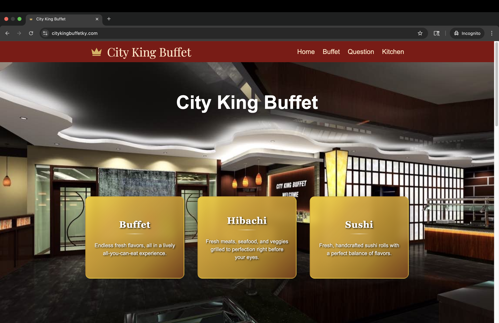

# City King Buffet Website

Official website for **[City King Buffet](https://citykingbuffetky.com)** — a full-stack application that allows customers to view buffet and kitchen menus, check prices, and interact with an AI-powered chatbox for restaurant-related questions.



---

## Why This Project Matters

This project demonstrates my ability to take a real-world business need from concept to launch:

- **Built for a Live Business** – City King Buffet’s official public-facing website, serving customers daily.
- **Full-Stack & AI Integration** – Combined a Next.js/Tailwind frontend with a Django REST API backend, PostgreSQL database, and an AI chatbot powered by OpenAI and LangChain.
- **Operational Efficiency** – The chatbot answers common customer questions instantly, reducing phone inquiries and freeing up staff time.
- **Custom Domain & Deployment** – Configured DNS, set up hosting on Render and Vercel, and integrated HTTPS with a branded domain.
- **Ongoing Maintainability** – Structured scripts for quickly updating menus, prices, and operating hours without touching production code.

This is a fully deployed solution with measurable value to an active restaurant business.

---

## Features

- **Buffet Menu & Kitchen Menu** – Displays menu items, categories, and prices.
- **AI Chatbox** – Answers customer questions using the restaurant's menu, pricing, and FAQ data.
- **Responsive UI** – Built with Tailwind CSS for mobile and desktop support.
- **Dynamic Pricing & Hours** – Centralized logic to update hours and prices.
- **Script Automation** – Easily update menus and FAQ vector stores with custom scripts.

---

## Tech Stack

**Frontend**
- Next.js
- Tailwind CSS
- TypeScript

**Backend**
- Django REST Framework
- PostgreSQL
- Python 3.12
- Pipenv

**AI & Data Processing**
- OpenAI API
- LangChain
- Vector database for embeddings

**Deployment**
- **Frontend:** Vercel (connected to `citykingbuffetky.com`)
- **Backend:** Render
- **Database:** Render PostgreSQL

---

## Environment Variables

### Backend (`Render` Environment)
- `ALLOWED_HOSTS`
- `DATABASE_URL`
- `DEBUG`
- `DJANGO_SECRET_KEY`
- `OPENAI_API_KEY`

### Frontend (`Vercel` Environment)
- `NEXT_PUBLIC_API_BASE` – Base URL for the backend API.

---

## Running Locally

### Prerequisites
- Python 3.12+
- Node.js 18+
- Pipenv
- PostgreSQL

### Backend Setup
```bash
cd backend
pipenv install
pipenv shell
python manage.py runserver
```

### Frontend Setup
```bash
cd frontend
npm install
npm run dev
```

---

## Scripts

### Ingest Data into Vectorstore
```bash
python backend/scripts/ingest.py
```

### Add Buffet Menu Items & Categories
```bash
python backend/scripts/add_buffet_category.py
python backend/scripts/add_buffet_items.py
```

### Add Kitchen Menu Items & Categories
```bash
python backend/scripts/add_kitchen_category.py
python backend/scripts/add_kitchen_items.py
```

### Update Pricing & Hours
```bash
python backend/utils/pricing_and_hours.py
```

---

## Deployment Workflow

- **Frontend (Vercel)** – Push to `main` branch triggers automatic redeploy.
- **Backend (Render)** – Push to `main` branch redeploys backend API and runs migrations.

---

## Author

**Winson Dong** – [LinkedIn](https://www.linkedin.com/in/winsondong/)  

---

## Additional Notes

When you search *City King Buffet* on Google, the official site link appears — providing direct access for customers looking for menus, prices, and hours.
